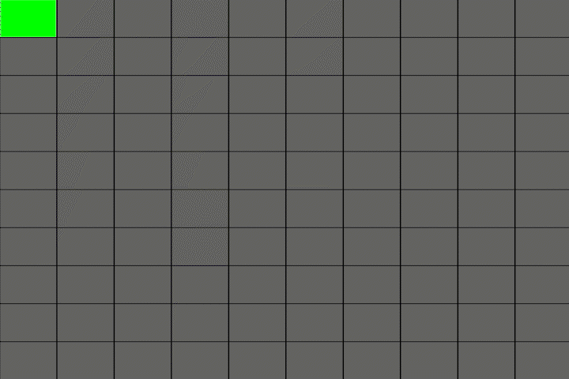

# Maze Generator and Solver

## Summary
Ever since taking AI classes in my Master's, I've been fascinated by [maze-solving algorithms](https://en.wikipedia.org/wiki/Maze-solving_algorithm).
But to implement maze-solving algorithms, you also need to have a maze. 

In this project, I've used [backtracking depth-first search](https://en.wikipedia.org/wiki/Maze_generation_algorithm#Randomized_depth-first_search) to generate random mazes, and then implemented the [A* search](https://en.wikipedia.org/wiki/A*_search_algorithm) algorithm to solve those mazes.

Although all the code I've written are my own, I was inspired by the youtube channel Coding Train's [Coding Challenge 10](https://www.youtube.com/watch?v=HyK_Q5rrcr4).

You can check out my implementation without any installation [here](https://itshaldun.github.io/projects/maze-generator/maze-generator.html).

## How it Works
I'll briefly explain how the two major algorithms used in this project works. I'll write a blog about them later, so look forward to that!

### Maze Generation
The algorithm works as follows:
- Create a grid of cells with 4 walls around each. Initially, these cells are all unvisited.
- As long as there are unvisited cells, do the following:
	- If any of the neighbors of the current cell are not visited:
		- Choose a random neighbor
		- Keep a record of the current cell
		- Remove the walls between the neighbor and the current cell
		- Move to the neighbor and mark it as visited
	- If all neighbors are visited, go back to one of the recorded cells and make it the current cell.

### Maze Solver
A* algorithm uses the sum of two cost functions to choose where to go in a [weighted graph](https://en.wikipedia.org/wiki/Graph_(discrete_mathematics)#Weighted_graph). These two functions are g(n) and h(n). g(n) is the cost of least expensive path from the start to the current cell, while h(n) is any [heuristic](https://en.wikipedia.org/wiki/Heuristic) that we can choose. I chose [manhattan distance](https://en.wikipedia.org/wiki/Taxicab_geometry) to the goal for this.

The algorithm simply moves through the cells based on the sum of these two metrics. Youtube channel Computerphile has a phenomenal video explaining the algorithm, which you can watch [here](https://www.youtube.com/watch?v=ySN5Wnu88nE).

## How to Install
- Just clone or download the files. You can use variety of ways to host the website locally.
- I use live server from VS Code.

## How to Play
This time, you have a lot of options to customize the maze. Major ones are for the maze size and the speed of the animation, but you can also change all colors.

It's also possible to save the maze as an image or regenerate a new one. Keep in mind that the start and end positions of the maze are randomized.

After generating the maze, you can use the solver section. There, you can also change the colors of the final path found, or the cells that were visited by the search algorithm (trace color).

Again, you can check it out [here](https://itshaldun.github.io/projects/maze-generator/maze-generator.html).